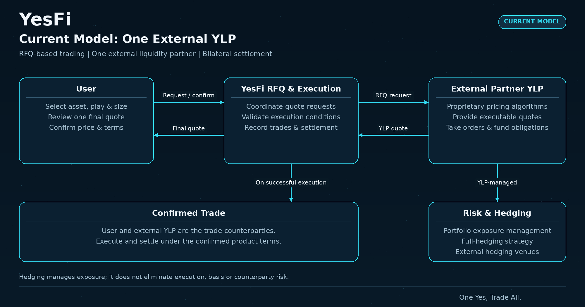
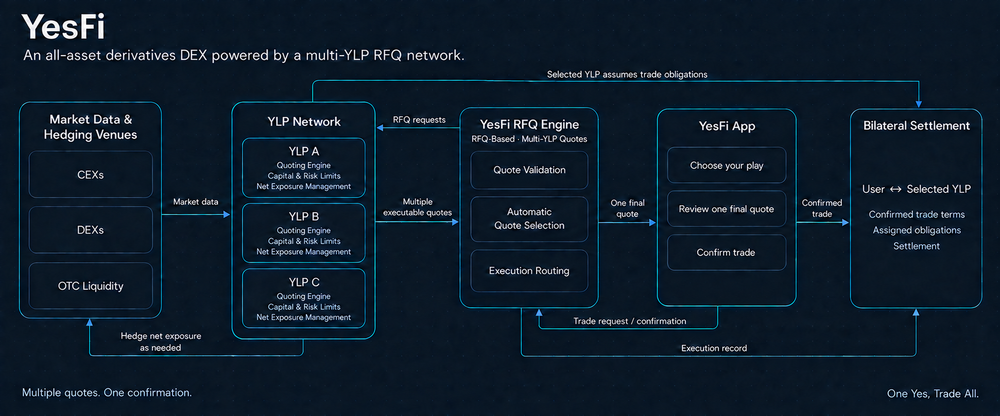
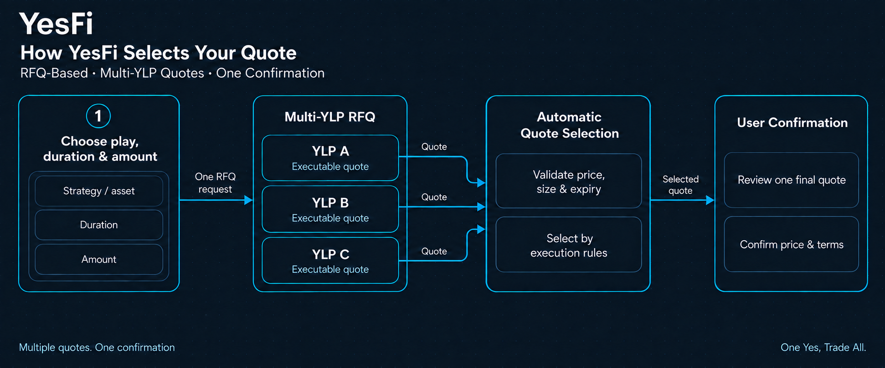
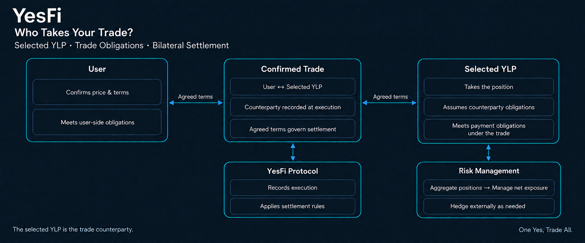
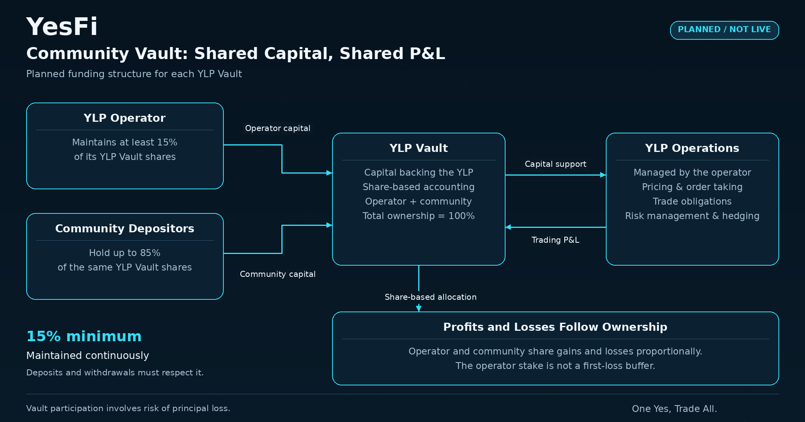

# YLP Liquidity Network

YesFi is a derivatives DEX built on a Request for Quote (RFQ) model. Users select their trade parameters, and YLPs return executable quotes. Once a user confirms and the trade is executed, the YLP taking the order fulfills its obligations, with settlement governed by the relevant product rules.

Liquidity is currently provided by a single external YLP partner. YesFi plans to upgrade to a multi-YLP network: the same request will be sent to multiple eligible YLPs, and the system will select one quote for the user to confirm under predefined rules. Until this upgrade is complete, execution does not involve comparing quotes from multiple YLPs.

### What Is a YLP?

A YLP (YesFi Liquidity Provider) quotes on specific trade terms, takes executed orders, and assumes the associated obligations. YesFi coordinates RFQ and execution, records trades, and handles settlement under the relevant product rules.

| Participant | Responsibilities                                                                                                                                   |
| ----------- | -------------------------------------------------------------------------------------------------------------------------------------------------- |
| User        | Selects and confirms trade terms and meets applicable obligations, such as paying premiums or providing margin.                                    |
| YLP         | Provides executable quotes; once selected and the trade is executed, takes the position and assumes agreed payment, payout, and other obligations. |
| YesFi       | Initiates RFQs, validates and compares quotes, records trades, and implements settlement arrangements under the relevant product rules.            |

A quote specifies executable terms, rather than an indicative reference price. It includes the price or payout terms, executable size, and expiry, and is intended for actual execution. Settlement methods, margin requirements, and outcome determination rules are defined for each product and presented before confirmation.

### Current Model: A Single External YLP Partner

YesFi currently relies on a single external YLP partner for liquidity. This YLP operates a sophisticated market-making strategy, generating competitive quotes based on market data, product structure, trade size, funding costs, and risk exposure. It supports quoting, order taking, and fulfillment of trade obligations.

<figure><figcaption></figcaption></figure>

_Current model: a single external YLP partner_

#### How Trades Work Today

1. The user selects the asset, direction or play, amount, and applicable duration. The system generates an RFQ.
2. The partner YLP returns a quote containing the price, executable size, and expiry.
3. The user confirms the price and terms, and the system performs execution checks.
4. Once executed, the trade is taken by the partner YLP and settled under the confirmed terms.

YesFi uses a P2P (Peer-to-Peer) bilateral trading model. The user and the YLP taking the order fulfill their respective obligations under the agreed terms. The current process does not involve quote competition between multiple YLPs.

#### Market Making and Risk Management

The partner YLP manages risk based on net portfolio exposure and employs a full-hedging strategy to reduce directional exposure and optimize long-term returns. Hedging is organized at the portfolio level; it does not mean that every user trade is individually replicated in an external market.

Full hedging describes a risk-management strategy, not a guarantee of zero exposure at every moment. Execution delays, basis risk, liquidity constraints, and counterparty risk may still affect hedge effectiveness and market-making returns.

### How the Multi-YLP Network Will Work

_YesFi plans to upgrade to a multi-YLP RFQ network by the end of 2026. The following describes the proposed mechanism. Actual participants, supported products, and launch timing will be announced separately._

Following the upgrade, YesFi will send the same trade parameters to multiple eligible YLPs. Each YLP independently decides whether to quote, at what price, and for what size. The system compares valid quotes on equivalent terms and returns one result to the user. Once the user confirms and execution succeeds, the YLP behind that quote takes the entire order.

<figure><figcaption></figcaption></figure>

_Planned YesFi multi-YLP RFQ network_

_Multiple YLPs provide quotes and execution capacity. YesFi coordinates RFQs, compares quotes, and executes trades confirmed by users._

The process has five steps: standardize the RFQ → request quotes → YLPs price the trade → select a quote under predefined rules → finalize execution after confirmation.

#### 1. Standardize the User’s Request

Users continue to select the asset, play or direction, amount, and applicable duration through the existing trading interface. The system creates an RFQ and sends the same parameters to the YLPs included in that request. Changes to key parameters, such as amount or duration, trigger a new RFQ.

Request and response fields differ by product, but all quotes within a given RFQ must be compared on a consistent basis:

| Product       | Parameters shared across the RFQ                                                        | Quote returned by the YLP                                                           |
| ------------- | --------------------------------------------------------------------------------------- | ----------------------------------------------------------------------------------- |
| Perpetuals    | Asset, buy or sell direction, quantity, and applicable margin and settlement rules      | Buy or sell price for the requested quantity, available size, and expiry            |
| Flash Options | Asset, play, duration, trigger or outcome conditions, and premium amount or payout size | Premium or potential payout for the specified structure, available size, and expiry |

Payoff structures, reference-price rules, and settlement conditions remain consistent so that quotes with different risk and return profiles are not compared as equivalent. Changes to key parameters require a fresh request using the updated terms.

#### 2. Request Quotes from Eligible YLPs in Parallel

The system determines which YLPs can participate based on supported products and assets, admission status, and current service availability.

Multiple eligible YLPs receive the request and respond within a common quoting window. Users do not need to contact or select them individually.

Each YLP decides whether to participate. It returns a quote when it supports the product and has capacity to take the trade. It may decline to quote if risk limits, market conditions, or other constraints prevent it from meeting the request. The network supports multiple quote providers, but the number of valid responses to any request depends on real-time conditions.

#### 3. Each YLP Prices the Trade Based on Its Capital and Risk Position

Each YLP combines market pricing with its own capacity to take the trade:

* **Market and product valuation:** Real-time market prices, volatility, duration, and the product’s payoff structure inform the trade’s value.
* **Funding and execution costs:** Trade size, capital commitments, external hedging liquidity, and expected execution costs are considered.
* **Positions and risk limits:** The YLP evaluates how the trade affects its existing portfolio exposure and checks available capital and risk limits.

The same trade can affect different YLPs differently. It may increase an already concentrated exposure for one YLP while offsetting part of another YLP’s portfolio. These differences influence quotes and available size, forming the basis for quote competition.

Each quote is attributable to a specific YLP and includes price or payout terms, executable quantity, and expiry. Quotes are submitted for actual execution, rather than merely as inputs to the system’s pricing model.

**Seller-Side Quoting for Flash Options**

For Flash Options, each YLP provides quotes as an option seller. YesFi provides reference data on historical and implied volatility from internal and external market sources. YLPs may use this data or apply their own volatility estimates and pricing models to quote independently, taking into account the product structure, time to expiry, trade size, and risk exposure.

Under standardized product settlement rules, YesFi converts seller quotes into user-facing premiums, potential payouts at expiry, and return multiples. These provide the basis for subsequent quote comparison and selection under equivalent trading conditions. The selected YLP takes the order and assumes the associated contractual obligations.

Volatility data serves as a pricing reference and does not guarantee market outcomes or user returns.

#### 4. Validate Quotes and Select the Best Executable Terms

The system first checks whether each quote matches the RFQ, remains valid, covers the full order size, and meets capital and risk requirements. Expired quotes, insufficient-size quotes, and quotes with mismatched terms are excluded from the final comparison.

Eligible quotes are ranked by what the user would actually pay or receive:

| Trade type                        | Comparison rule                                                                             |
| --------------------------------- | ------------------------------------------------------------------------------------------- |
| Perpetual buy                     | Prefer the lower total payment for the same quantity and terms.                             |
| Perpetual sell                    | Prefer the higher net proceeds for the same quantity and terms.                             |
| Flash Options — fixed premium     | Prefer the higher potential payout for the same payoff structure and settlement conditions. |
| Flash Options — fixed payout size | Prefer the lower premium for the same structure and settlement conditions.                  |

Comparisons account for applicable fees, rather than nominal prices alone. When price terms are equal, predefined rules may consider response latency, historical execution reliability, and remaining capacity. In the initial design, a single selected YLP takes each order in full; multiple smaller quotes are not combined into one execution.

Additional constraints:

* The selected result is the most favorable to the user among quotes received for that RFQ that satisfy equivalent terms and execution requirements. It is not a claim of the best price across the entire market.
* One selected YLP takes the full order. Insufficient-size quotes from multiple YLPs are not combined.
* The selection is traceable: records must show which valid quotes were compared and why the final quote was chosen.

#### 5. The User Reviews and Confirms the Final Quote

<figure><figcaption></figcaption></figure>

_Planned automated quote selection across multiple YLPs_

_Flash Options are shown as an example. RFQ distribution, validation, and selection take place in the background. The user only needs to confirm the final price and terms._

Users see only the final selected quote, without a list of competing quotes or a manual YLP selector. The quote comes from the selected YLP capable of taking the order and is tied to the specific trade parameters.

For Flash Options, users can review the premium, Max Loss, and Potential Payout before confirmation. The payout multiple reflects the market, cost, and risk assumptions embedded in that quote; it is not a probability of winning.

After confirmation, the system rechecks quote validity, consistency of terms, and the selected YLP’s capacity. If these checks pass, it reserves the required funds, records the trade, and attributes the order and position to that YLP.

Confirmation applies to that specific quote and YLP:

* Execution follows the confirmed price and terms, regardless of subsequent quotes from other YLPs.
* If the quote has expired, capacity is insufficient, or the original terms cannot be honored, the user is prompted to refresh or request a new quote. The order is not executed, reassigned to another YLP, or filled on worse terms.
* Quote confirmation and successful execution are distinct states. The order record determines the actual outcome.

### Order Taking and Fulfillment

<figure><figcaption></figcaption></figure>

_Planned multi-YLP trade obligations and risk management_

_Planned multi-YLP trade relationships. Risk management is shown as a general network process; each YLP’s specific hedging strategy follows its own arrangements._

The external partner YLP currently takes orders. Following the upgrade, the selected YLP will assume the agreed payment, payout, and other obligations. YLPs that are not selected have no obligations for that trade.

Hedging takes place on the market-making side and does not change the user’s confirmed terms. Once a perpetual position is opened, increases, reductions, closing trades, funding payments, and liquidation remain associated with the original YLP. The position is not reassigned to another YLP after execution.

For example, when a user purchases a Flash Option and pays the premium, the YLP taking the order must make the payout if the settlement conditions are met. The outcome is determined at expiry under the agreed rules. When a user opens a perpetual position and provides margin, the YLP takes the corresponding position; funding, maintenance margin, and liquidation follow the perpetual product rules.

The system links the RFQ, all submitted quotes, selection results, confirmed terms, execution, and responsible YLP in its records to support settlement, reconciliation, and review.

#### The YLP Network Experience

**Competitive Quotes:** After the upgrade, the system will compare valid quotes from different YLPs and return a single executable result. Users will still confirm only once.

**Simple Interaction:** Users continue to review and confirm the final quote, while RFQ distribution, validation, and quote selection take place in the background.

**A Consistent Process:** Flash Options, perpetuals, and other products follow the same RFQ and confirmation process. Please refer to the relevant product pages for supported products and features.

#### Why Are There No Additional Trading Fees?

YesFi does not charge an additional trading commission on Flash Options or perpetuals. YLPs incorporate the costs and risks of providing liquidity into their quotes and seek returns through market making.

For perpetuals, market-making returns reflect quoted spreads, position P\&L, and hedging costs. For Flash Options, they reflect premiums, actual payouts, and risk-management costs. Neither spreads nor premiums equal net profit, and YLPs can incur losses.

Zero trading fees do not mean zero trading costs. Quotes may include spreads; Flash Options require a premium, and perpetual positions may incur funding payments. Any fees for optional trading insurance, fund transfers, or other services are governed by the relevant product rules.

### Funding and Community Vaults

#### Current Funding Arrangements

The external partner YLP currently provides capital to support the trades it takes and fulfills the associated obligations. After the multi-YLP network launches, each YLP will allocate capital to its orders in accordance with admission and risk-management requirements.

#### Future Community Vaults

YesFi plans to open community vaults after system stability and market-making performance have been sufficiently validated. Users will be able to deposit into a corresponding YLP Vault to support that YLP’s liquidity provision. The YLP operator will manage quoting, order taking, and risk. Community vaults and the multi-YLP network will be developed separately, with vault launch dates announced independently.

Each YLP operator must continuously hold at least **15% of the shares in its YLP Vault**. The operator and community depositors share profits and losses in proportion to their holdings. The operator’s capital is not a subordinated first-loss tranche and does not guarantee community principal or returns.

The percentage is measured using current vault shares and their corresponding net asset value, rather than historical cumulative deposits. New community deposits and operator withdrawals must comply with the minimum holding requirement. If an action would reduce the operator’s holding below 15%, the operator must first contribute additional capital, or the relevant transaction must be restricted.

Community vaults are not yet open. Permitted uses of funds, share valuation, fees, deposit and withdrawal restrictions, and exit rules will be published before launch. Vault participation involves the risk of principal loss, and returns are not guaranteed.

<figure><figcaption></figcaption></figure>

_Planned community vault: operator holds at least 15% continuously, with proportional sharing of profits and losses_

#### Settlement and Risk

Rights and obligations after execution are determined by the confirmed order terms and the relevant product rules. YLP quoting and hedging capabilities do not eliminate market risk or the risk of failure to meet trade obligations. Collateral, margin, liquidation, and exceptional-event handling follow the specific rules of each product.

Perpetuals use isolated margin. Flash Options and perpetuals have separately managed risk pools. These arrangements do not imply that each YLP currently has a separate onchain vault, nor do they guarantee returns or fulfillment of obligations.

Teams with professional market-making, capital-management, and risk-management capabilities interested in becoming a YesFi YLP can contact [contact@yesfi.com](mailto:contact@yesfi.com).
